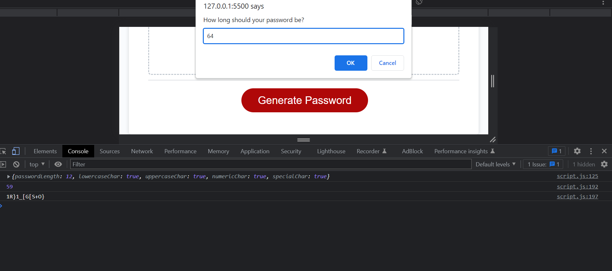

# Password-Generator

## Description

The repo uses javascript to build a random password generator. Clicking the Generate Password button will trigger the app to randomly generate a password that meets the following criteria:
    1. Password consists of at least ten characters but no more than 64 characters.
    2. Password consists of at least one of lowercase, uppercase, numeric and special characters that may occur in any combination depending on the User's choice.
    3. The code should validate for each input.

Screenshot of the app.

## Installation

N/A

## Usage

This project when completed will serve as a central hub that contains links to all my other deployed projectts.

## Credits

N/A

## License

MIT License

Copyright (c) 2023 Zee Mudia

Permission is hereby granted, free of charge, to any person obtaining a copy
of this software and associated documentation files (the "Software"), to deal
in the Software without restriction, including without limitation the rights
to use, copy, modify, merge, publish, distribute, sublicense, and/or sell
copies of the Software, and to permit persons to whom the Software is
furnished to do so, subject to the following conditions:

The above copyright notice and this permission notice shall be included in all
copies or substantial portions of the Software.

THE SOFTWARE IS PROVIDED "AS IS", WITHOUT WARRANTY OF ANY KIND, EXPRESS OR
IMPLIED, INCLUDING BUT NOT LIMITED TO THE WARRANTIES OF MERCHANTABILITY,
FITNESS FOR A PARTICULAR PURPOSE AND NONINFRINGEMENT. IN NO EVENT SHALL THE
AUTHORS OR COPYRIGHT HOLDERS BE LIABLE FOR ANY CLAIM, DAMAGES OR OTHER
LIABILITY, WHETHER IN AN ACTION OF CONTRACT, TORT OR OTHERWISE, ARISING FROM,
OUT OF OR IN CONNECTION WITH THE SOFTWARE OR THE USE OR OTHER DEALINGS IN THE
SOFTWARE.
